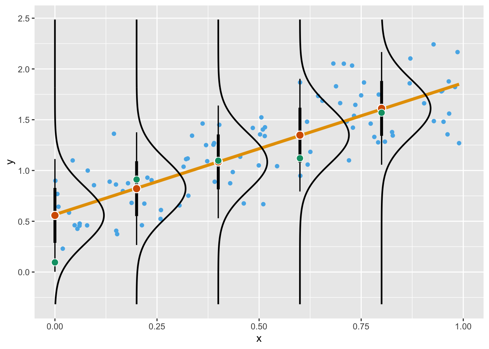
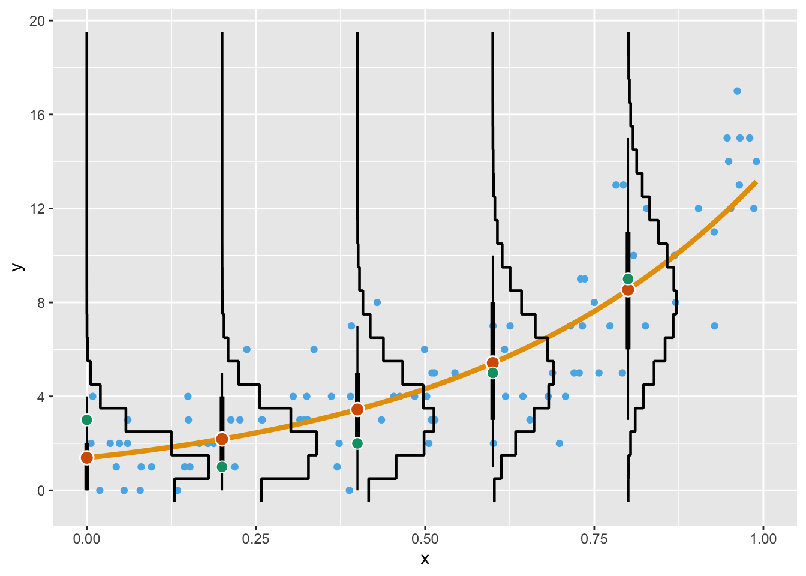
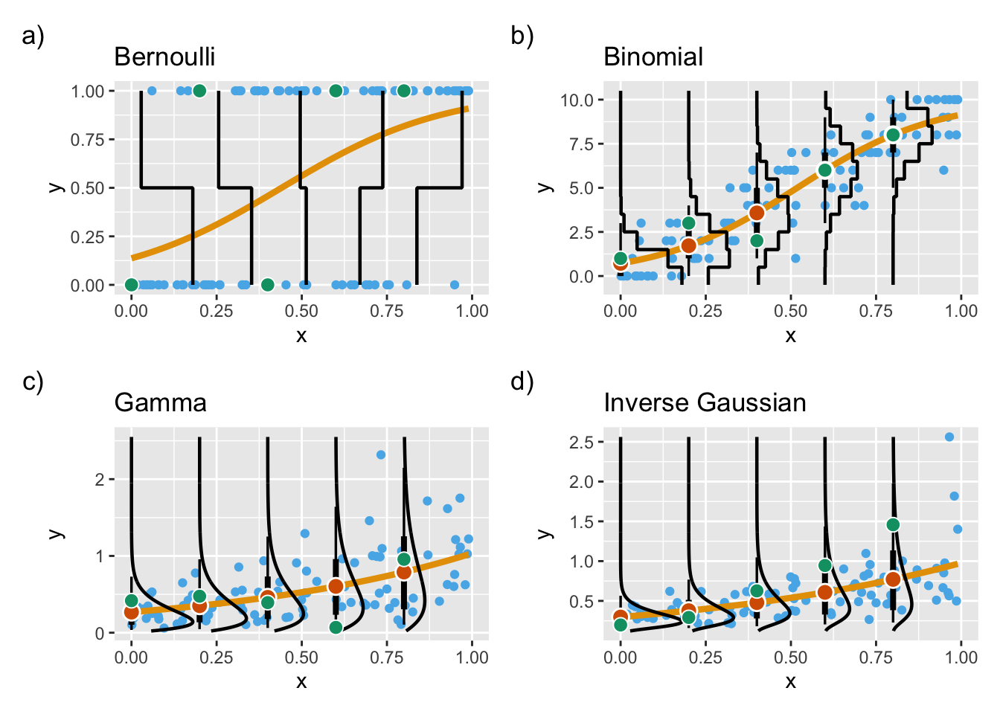
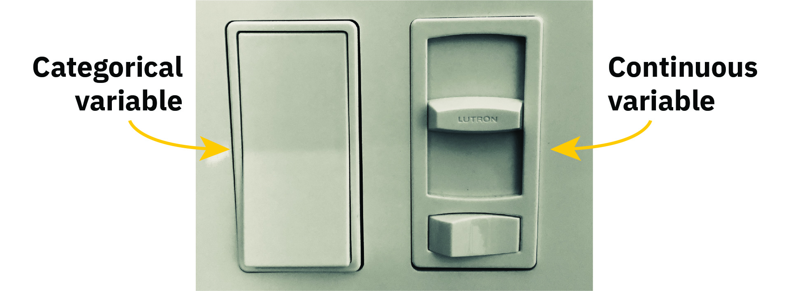

class: inverse middle center big-subsection

```{r setup, include=FALSE, cache=FALSE}
options(htmltools.dir.version = FALSE)
knitr::opts_chunk$set(cache = TRUE, dev = 'svg', echo = TRUE, message = FALSE, warning = FALSE,
                      fig.height = 6, fig.width = 1.777777 * 6, fig.align = "center")

library('here')
library('mgcv')
library('ggplot2')
library('purrr')
library("tibble")
library('patchwork')
library('tidyr')
library('readr')
library('dplyr')
## plot defaults
theme_set(theme_minimal(base_size = 16, base_family = 'Fira Sans'))

```

# Welcome

???

---

# Logistics

---

# Slides

Slidedeck: [https://bit.ly/420miIv](https://bit.ly/420miIv)

Sources: [https://bit.ly/409e6TM](https://bit.ly/409e6TM)

Direct download a ZIP of everything: [bit.ly/422MKkY](https://bit.ly/422MKkY)

Unpack the zip & remember where you put it

Or `usethis::use_course()`

---

# `use_course()`

```{r, eval = FALSE}
#install.packages("usethis")
usethis::use_course("https://bit.ly/422MKkY")
```

---

# You fitted a GLM(M), now what?

This was the main motivation for this course

The original idea was encapsulated in *You fitted a GLM(M), now what?*

---

# Today's topics

* Recap generalised linear models

* Fitting some GLMs

---

# packages

Load the packages we need

```{r}
library("dplyr")
library("readr")
library("tibble")
# install.packages("here")
library("here")
library("ggplot2")
```

---
class: inverse middle center subsection

# GLMs

---

# Generalized linear models

Generalised linear models (GLMs) are an extension of linear regression plus Poisson, logistic and other regression models

GLMs extend the types of data and error distributions that can be modelled beyond the Gaussian data of linear regression

With GLMs we can model count data, binary/presence absence data, and concentration data where the response variable is not continuous.

Such data have different mean-variance relationships and we would not expect errors to be Gaussian.

---

# Generalized linear models

Typical uses of GLMs are

- Poisson GLM for count data
- Logistic GLM for presence absence data
- Gamma GLM for non-negative or positive continuous data

GLMs can handle many problems that appear non-linear

Not necessary to transform data as this is handled as part of the GLM process

---

# Binomial distribution

* For a fixed number of trials (*n*),
* fixed probability of “success” (*p*), &
* two outcomes per trial (heads or tails)

Flip a coin 10 times with *p* = 0.7, the probability of 7 heads is $\sim Bin(n = 10, p = 0.7)$, ~ 0.27

```{r}
dbinom(x = 7, size = 10, prob = 0.7)
```

---

# Binomial distribution

```{r binomial-pdf, echo = FALSE}
## Binomial Probability mass function
s <- seq(0, 40, by = 1)
n <- rep(c(20,20,40), each = length(s))
binom.pmf <- data.frame(x = rep(s, 3),
                        n = rep(c(20,20,40), each = length(s)),
                        p = rep(c(0.5, 0.7, 0.5), each = length(s)))
binom.pmf <- transform(binom.pmf,
                       pmf = dbinom(x, size = n, prob = p),
                       params = paste("n=", n, "; p=", p, sep = ""))

plt.binom <- ggplot(binom.pmf, aes(x = x, y = pmf, colour = params)) +
    geom_point() + labs(y = "Probability Mass", x = "No. of Successes")
plt.binom
```

---

# Poisson distribution

The Poisson gives the distribution of the number of “things” (individuals, events, counts) in a given sampling interval/effort if each event is **independent**.

Has a single parameter $\lambda$ the average density or arrival rate

---

# Poisson distribution

```{r poisson-pdf, echo = FALSE}
s <- seq(0, 20, by = 1)
poisson.pmf <- data.frame(x = rep(s, 3),
                          lambda = rep(c(1,4,10), each = length(s)))
poisson.pmf <- transform(poisson.pmf,
                         pmf = dpois(x, lambda = lambda),
                         params = paste("lambda=", lambda, sep = ""))

plt.poisson <- ggplot(poisson.pmf, aes(x = x, y = pmf, colour = params)) +
    geom_point() + labs(y = "Probability Mass", x = "Count")
plt.poisson
```

---

# The structure of a GLM

.small[
1. A **Random component**, specifying the conditional distribution of of the response $y_i$ given the values of the explanatory data
2. A **Linear Predictor** $\eta$ &mdash; the linear function of regressors
    $$\eta_i = \alpha + \beta_1 x_{i1} + \beta_2 x_{i2} + \cdots + \beta_k x_{ik}$$
	The $x_{ij}$ are prescribed functions of the explanatory variables and can be transformed variables, dummy variables, polynomial terms, interactions etc.
3. A smooth and invertible **Link Function** $g(\cdot)$, which transforms the expectation of the response $\mu_i \equiv \mathbb{E}(y_i)$ to the linear predictor
    $$g(\mu_i) = \eta_i = \alpha + \beta_1 x_{i1} + \beta_2 x_{i2} + \cdots + \beta_k x_{ik}$$
    As $g(\cdot)$ is invertible, we can write
    $$\mu_i = g^{-1}(\eta_i) = g^{-1}(\alpha + \beta_1 x_{i1} + \beta_2 x_{i2} + \cdots + \beta_k x_{ik})$$
]

---

# Conditional distribution of $y_i$

Originally GLMs were specified for random components belonging to the *exponential family* of probability distributions

- Continuous probability distributions
    - Gaussian (or normal distribution; used in linear regression)
	- Gamma (data with constant coefficient of variation)
	- Exponential (time to death, survival analysis)
	- Chi-square
	- Inverse-Gaussian
- Discrete probability distributions
    - Poisson (count data)
	- Binomial (0/1 data, counts from a total)
	- Multinomial

Choice depends on range of $y_i$ and on the relationship between the variance and the expectation of $y_i$ &mdash; *mean-variance relationship*

---

# Conditional distribution of $y_i$

Characteristics of common GLM probability distributions


|                  | Canonical Link | Range of $Y_i$               | Variance function              |
|------------------|----------------|------------------------------|--------------------------------|
| Gaussian         | Identity       | $(-\infty, +\infty)$         | $\phi$                         |
| Poisson          | Log            | $0,1,2,\ldots,\infty$        | $\mu_i$                        |
| Binomial         | Logit          | $\frac{0,1,\ldots,n_i}{n_i}$ | $\frac{\mu_i(1 - \mu_i)}{n_i}$ |
| Gamma            | Inverse        | $(0, \infty)$                | $\phi \mu_i^2$                 |
| Inverse-Gaussian | Inverse-square | $(0, \infty)$                | $\phi \mu_i^3$                 |


$\phi$ is the dispersion parameter; $\mu_i$ is the expectation of $y_i$. In the binomial family, $n_i$ is the number of trials

---

# Common probability distributions

Gaussian distribution is rarely adequate in applied science; GLMs offer useful alternatives

.small[
- **Poisson** &mdash; counts; integers, non-negative, variance increases with mean

- **Binomial** &mdash; observed proportions from a total; integers, non-negative, bounded at 0 and 1, variance largest at $\pi = 0.5$

- **Binomial** &mdash; presence absence data; discrete values, 0 and 1, models probability of success

- **Gamma** &mdash; concentrations; non-negative (strictly positive with log link) real values, variance increases with mean, many zero values and some high values
]

---

# Old notation

Wrote linear model as

$$y_i = \alpha + \beta_1 x_{1i} + \beta_2 x_{2i} + \cdots + \beta_j x_{ij} + \varepsilon_i$$

And assumed

$$ \varepsilon_i \sim \text{Normal}(0, \sigma^2) $$

This doesn't work out the same for GLMs &mdash; we don't have residuals in the linear predictor

Sampling variation comes from the response distribution

---

# New notation

Rewrite linear model as

\begin{align*}
y_i & \sim \text{Normal}(\mu_i, \sigma^2) \\
\eta_i & = \alpha + \beta_1 x_{1i} + \beta_2 x_{2i} + \cdots + \beta_j x_{ij}
\end{align*}

This now matches the general form for the GLM

\begin{align*}
y_i & \sim \text{EF}(\mu_i, \boldsymbol{\theta}) \\
g(\mu_i) & = \alpha + \beta_1 x_{1i} + \beta_2 x_{2i} + \cdots + \beta_j x_{ij}
\end{align*}

---

# New notation

```{r dist-fig-1, fig.align = "center", out.width = "80%", echo = FALSE}

```

---

# New notation

Binomial GLM

\begin{align*}
y_i & \sim \text{Binomial}(n, p_i) \\
\text{logit}(p_i) & = \alpha + \beta_1 x_{1i} + \beta_2 x_{2i} + \cdots + \beta_j x_{ij}
\end{align*}

Poisson GLM

\begin{align*}
y_i & \sim \text{Poisson}(\lambda_i) \\
\log(\lambda_i) & = \alpha + \beta_1 x_{1i} + \beta_2 x_{2i} + \cdots + \beta_j x_{ij}
\end{align*}


---

# New notation

```{r dist-fig-2, fig.align = "center", out.width = "80%", echo = FALSE}

```

---

# New notation

```{r dist-fig-3, fig.align = "center", out.width = "80%", echo = FALSE}

```

---
class: inverse middle center subsection

# Examples

---

# Logistic regression &mdash; *Darlingtonia*

Timed censuses at 42 randomly-chosen leaves of the cobra lily

.small[
* Recorded number of wasp visits at 10 of the 42 leaves
* Test hypothesis that the probability of visitation is related to leaf height
* Response is dichotomous variable (0/1)
* A suitable model is the logistic model
    $$\pi = \frac{e^{\beta_0 + \beta_i X}}{1 + e^{\beta_0 + \beta_1 X_i}}$$
* The logit transformation produces
    $$\log_e \left( \frac{\pi}{1-\pi} \right) = \beta_0 + \beta_1 X_i$$
* This is the logistic regression and it is a special case of the GLM, with a binomial random component and the logit link function
]

---

# Logistic regression &mdash; *Darlingtonia*

$$\log_e \left( \frac{\pi}{1-\pi} \right) = \beta_0 + \beta_1 X_i$$

.small[
* $\beta_0$ is a type of intercept; determines the probability of success ( $y_i = 1$ ) $\pi$ where X = 0
* If $\beta_0 = 0$ then $\pi = 0.5$
*  $\beta_1$ is similar to the slope and determines how steeply the fitted logistic curve rises to the maximum value of $\pi = 1$
* Together, $\beta_0$ and $\beta_1$ specify the range of the $X$ variable over which most of the rise occurs and determine how quickly the probability rises from 0 to 1
* Estimate the model parameters using **Maximum Likelihood**; find parameter values that make the observed data most probable
]

---

# Logistic regression &mdash; *Darlingtonia*

```{r load-darl-data, echo = TRUE, eval = FALSE}
wasp <- read_csv("data/darlingtonia.csv", comment = "#",
                 col_types = "dl")
wasp
```

```{r load-darl-data-real, echo = FALSE, eval = TRUE}
wasp <- read_csv("../data/darlingtonia.csv", comment = "#",
                 col_types = "dl")
wasp
```
---

# Logistic regression &mdash; *Darlingtonia*

```{r fit-darlingtonia, echo = TRUE}
m <- glm(visited ~ leafHeight, data = wasp, family = binomial)
m
```

---

# Logistic regression &mdash; *Darlingtonia*

.smaller[
```{r summary-darlingtonia, echo = TRUE}
summary(m)
```
]

---

# Logistic regression &mdash; *Darlingtonia*

.row[
.col-6[
.smaller[
```{r predict-darlingtonia, echo = TRUE, eval = FALSE}
# data to predict at
pdat <- with(wasp,
             tibble(leafHeight = seq(min(leafHeight),
                                     max(leafHeight),
                                     length = 100)))
# predict
pred <- predict(m, pdat, type = "link", se.fit = TRUE)
ilink <- family(m)$linkinv # g-1()
pdat <- pdat |>
  bind_cols(data.frame(pred)) |>
  mutate(fitted = ilink(fit),
         upper = ilink(fit + (2 * se.fit)),
         lower = ilink(fit - (2 * se.fit)))
# plot
ggplot(wasp, aes(x = leafHeight,
                 y = as.numeric(visited))) +
    geom_point() +
    geom_ribbon(aes(ymin = lower, ymax = upper,
                    x = leafHeight), data = pdat,
                inherit.aes = FALSE, alpha = 0.2) +
    geom_line(data = pdat, aes(y = fitted)) +
    labs(x = "Leaf Height [cm]",
         y = "Probability of visitation")
```
]
]

.col-6[
```{r predict-darlingtonia, eval = TRUE, echo = FALSE, fig.height = 6, fig.width = 6}
```
]

]

---

# Wald statistics

$z$ values are Wald statistics, which under the null hypothesis are *asymptotically* standard normal

```{r coeftab-darlingtonia, results = "asis", echo = FALSE}
knitr::kable(round(summary(m)$coefficients, 4), format = "pipe")
```

<br />
Tests the null hypothesis that $\beta_i = 0$
$$z = \hat{\beta}_i / \mathrm{SE}(\hat{\beta}_i)$$

---

# Deviance

.small[
* In least squares we have the residual sum of squares as the measure of lack of fitted
* In GLMs, **deviance** plays the same role
* Deviance is defined as twice the log likelihood of the observed data under the current model
* Deviance is defined relative to an arbitrary constant &mdash; only **differences** of deviances have any meaning
* Differences in deviances are also known as ratios of likelihoods
* An alternative to the Wald tests are deviance ratio or likelihood ratio tests
    $$F = \frac{(D_a - D_b) / (\mathsf{df}_a - \mathsf{df}_b)}{D_b / \mathsf{df}_b}$$
* $D_j$ deviance of model, where we test if model A is a significant improvement over model B; $\mathsf{df}_k$ are the degrees of freedom of the respective model
]

---

# A Gamma GLM &mdash; simple age-depth modelling

Radiocarbon age estimates from depths within a peat bog (Brew & Maddy, 1995, QRA Technical Guide 5)

Estimate accumulation rate; assumption here is linear accumulation

Uncertainty or error is greater at depth; mean variance relationship

Fit mid-depth & mid-calibrated age points

---

# A Gamma GLM &mdash; simple age-depth modelling

```{r load-maddy, echo = TRUE}
maddy <- read_csv(here("data", "maddy-peat.csv"), col_types = "cdddddd")
maddy <- mutate(maddy, midDepth = upperDepth - (0.5 * abs(upperDepth - lowerDepth)),
                calMid = calUpper - (0.5 * abs(calUpper - calLower)))
maddy
```

---

# A Gamma GLM &mdash; simple age-depth modelling

.row[

.col-6[
```{r plot-maddy, echo = TRUE, eval = FALSE}
ggplot(maddy, aes(x = midDepth, y = calMid)) +
    geom_point() +
    labs(y = "Calibrated Age", x = "Depth")
```

]

.col-6[
```{r plot-maddy, echo = FALSE, eval = TRUE, fig.height = 6, fig.width = 6}
```
]
]

---

# A Gamma GLM

.smaller[
```{r peat-model, echo = TRUE}
m_gamma <- glm(calMid ~ midDepth, data = maddy, family = Gamma(link = "identity"))
summary(m_gamma)
```
]

---

# A Gamma GLM

.row[

.col-6[
.smaller[
```{r plot-maddy-fitted-gamma, eval=FALSE}
# data to predict at
pdat <- with(maddy,
             tibble(midDepth = seq(min(midDepth),
                                   max(midDepth),
                                   length = 100)))
# predict
p_gamma <- predict(m_gamma, pdat, type = "link",
                   se.fit = TRUE)
ilink <- family(m_gamma)$linkinv
# confidence interval
p_gamma <- pdat %>%
  bind_cols(data.frame(p_gamma)) %>%
  mutate(fitted = ilink(fit),
         upper = ilink(fit + (2 * se.fit)),
         lower = ilink(fit - (2 * se.fit)))
# plot
p1 <- ggplot(maddy, aes(x = midDepth, y = calMid)) +
    geom_ribbon(aes(ymin = lower, ymax = upper,
                    x = midDepth), data = p_gamma,
                inherit.aes = FALSE, alpha = 0.2) +
    geom_line(data = p_gamma, aes(y = fitted)) +
    geom_point() +
    labs(y = "Calibrated Age", x = "Depth",
         title = "Gamma GLM")
p1
```
]
]

.col-6[
```{r plot-maddy-fitted-gamma, echo = FALSE, eval = TRUE, fig.height = 6, fig.width = 6}
```

]
]

---

# A Gaussian GLM

.row[

.col-6[
.smaller[
```{r plot-maddy-fitted-gaussian, eval = FALSE}
# fit gaussian GLM
m_gaus <- glm(calMid ~ midDepth, data = maddy,
              family = gaussian)
# predict
p_gaus <- predict(m_gaus, pdat, type = "link",
                  se.fit = TRUE)
ilink <- family(m_gaus)$linkinv
# prep confidence interval
p_gaus <- pdat %>%
  bind_cols(data.frame(p_gaus)) %>%
  mutate(fitted = ilink(fit),
         upper = ilink(fit + (2 * se.fit)),
         lower = ilink(fit - (2 * se.fit)))
# plot
p2 <- ggplot(maddy, aes(x = midDepth, y = calMid)) +
    geom_ribbon(aes(ymin = lower, ymax = upper,
                    x = midDepth), data = p_gaus,
                inherit.aes = FALSE, alpha = 0.2) +
    geom_line(data = p_gaus, aes(y = fitted)) +
    geom_point() +
    labs(y = "Calibrated Age",
         x = "Depth",
         title = "Linear Model")
p2
```

]
]

.col-6[
```{r plot-maddy-fitted-gaussian, echo = FALSE, eval = TRUE, fig.height = 6, fig.width = 6}
```

]
]

---

```{r}
library("patchwork")
p1 + p2
```

---

# Transform or GLM?

```
m1 <- glm(log(y) ~ x, data = my_data, family = Gamma(link = "identity"))

m2 <- glm(y ~ x, data = my_data, family = Gamma(link = "log"))
```

These models are different

1. `m1` is a model for $\mathbb{E}(\log(y_i))$
2. `m2` is a model for $\mathbb{E}(y_i)$

$$
\log(\mathbb{E}(y_i)) \neq \mathbb{E}(\log(y_i))
$$

Jensen's inequality

---

# Biological control of diamondback moths

.small[
Uefune et al (2020) studied the use of synthetic herbivory-induced plant volatiles (HIPVs) to attract larval parasitoid wasps (*Cotesia vestalis*) to control diamondback moths (DBM: *Plutella xylostella*), a global pest of cruciferous vegetables, in greenhouses growing mizuna (Japanese mustard) in Japan.

They used two groups of greenhouses, the treated group having dispensers for the HIPVs as well as honeyfeeders to attract *C. vestalis* and a second untreated group. In each greenhouse, a single sticky trap, replaced weekly over 6 months, was used to catch both DBMs and *C. vestalis* and the numbers of both counted.

We will model numbers of *C. vestalis* against numbers of DBM and treatment using each trap as the units of analysis. The study was done in 2006 and 2008 but we only analyze the 2008 data.
]

???

While greenhouse ID could have been included as a random effect in a mixed model analysis, the available data did not record individual greenhouses.

---

# Biological control of diamondback moths

> We will model numbers of *C. vestalis* against numbers of DBM and treatment using each trap as the units of analysis.

What distribution would you expect the response variable parasitoid to follow?

---

# Diamondback moths &mdash; data

```{r load-moth-show, eval = FALSE}
moth <- readr::read_csv("data/uefunex.csv")
```
```{r load-moth-hide, echo = FALSE}
moth <- readr::read_csv("../data/uefunex.csv")
```

---

# Diamondback moths &mdash; summary stats

```{r moth-summary}
library("dplyr")
moth |>
    group_by(treatment) |>
    summarise(n = n(), mean = mean(parasitoid), median = median(parasitoid),
        sd = sd(parasitoid))
```

---

# Diamondback moths &mdash; plot data

```{r plot-moth-1, out.width = "80%", fig.align = "center"}
library("ggplot2")
moth |>
    ggplot(aes(x = treatment, y = parasitoid)) +
    geom_violin(aes(fill = treatment))
```

---

# Diamondback moths

```{r plot-moth-sqrt, out.width = "80%", fig.align = "center"}
moth |>
    ggplot(aes(x = treatment, y = parasitoid)) +
    geom_violin(aes(fill = treatment)) +
    scale_y_sqrt()
```

---

# Diamondback moths

```{r plot-moth-root-root, out.width = "70%", fig.align = "center"}
# install.packages("ggforce")
moth |>
    ggplot(aes(x = treatment, y = parasitoid)) +
    geom_violin(aes(fill = treatment)) +
    scale_y_continuous(trans = ggforce::power_trans((1/4)))
```

---

# Biological control of diamondback moths

What do you conclude about the response variable?

What distribution would you expect the response variable parasitoid to follow?

---

# Fit Poisson GLM

```{r fit-poisson-glm-moth}
moth_glm1 <- glm(parasitoid ~ moth + treatment + moth:treatment,
    family = poisson, data = moth)
```

---

# Poisson GLM summary

```{r summary-poisson-glm-moth}
summary(moth_glm1)
```

---

# Analysis of deviance table

```{r}
anova(moth_glm1, test = "LRT")
```

---

# Plot the estimated model

.row[

.col-6[
.small[
```{r plot-moth-glm1, eval=FALSE}
moth |>
    ggplot(aes(y = parasitoid, x = moth, color = treatment)) +
    geom_jitter(stat = "identity", width = 0.05, height = 0.05) +
    geom_smooth(method = "glm", method.args = list(family = "poisson")) +
    theme(legend.position = "bottom")
```
]
]

.col-6[
```{r plot-moth-glm1, echo = FALSE, fig.width = 7, fig.height = 5}
```
]
]

---

# Problems

```{r moth-summary}
```

---

# Overdispersion

```{r}
presid <- resid(moth_glm1, type = "pearson")
n <- nrow(moth)
params <- length(coef(moth_glm1))
disp <- sum(presid^2) / (n - params)
disp
```

---

# Overdispersion

.small[
```{r}
moth_glm2 <- glm(parasitoid ~ moth + treatment + moth:treatment,
    family = quasipoisson, data = moth)

summary(moth_glm2)
```
]

---

# Negative binomial

.small[
```{r}
library("mgcv")
moth_glm3 <- gam(parasitoid ~ moth + treatment + moth * treatment,
    family = nb(), method = "ML", data = moth)
summary(moth_glm3)
```
]

---
class: inverse middle center subsection

# Better coffee-growing

---

# Better coffee-growing

.small[
Caudill and Rice (2012) examined the effectiveness of methods for making agriculture and habitat preservation more compatible, specifically assessing whether protocols for “Biodiversity-Friendly” coffee growing resulted in positive outcomes for mammals.

They compared four habitats, forest, Bird Friendly® shade, conventional shade, and sun coffee, and used a combination of Sherman traps and camera traps to count mammals and assess species richness. Each habitat was represented by multiple sites, with 23 total sites monitored. At each site, they also recorded a series of plant habitat variables, such as cover at canopy, mid- and lower-strata, and ground level, tree basal area.

They were interested primarily in differences between habitats, but also the role of vegetation characteristics in influencing mammal diversity. We focus on this latter relationship.
]

---

# Better coffee-growing

Read in the data

```{r load-coffee-show, eval = FALSE}
coffee <- readr::read_csv("data/caudill.csv")
```
```{r load-coffe-hide, echo = FALSE}
coffee <- readr::read_csv("../data/caudill.csv")
```

Forest habitat has no coffee trees, and low tree richness, so habitat variables not all present. Create subset of this data

```{r}
coffee <- coffee |>
    dplyr::filter(habitat != "Forest")
```

We will consider the number of small individuals

---

# Better coffee-growing

.small[
```{r}
coffee_glm <- glm(specdens_small ~ canopy + midstrata + lowstrata + groundcov +
        treerichness + treeheight + coffeeheight,
    data = coffee, family = poisson)
summary(coffee_glm)
```
]

---

# Why do gnus die?

Sinclair and Arcese (1995) were interested in the causes (predation or other) of death of wildebeeste, more specifically whether predation varied with sex and health of animals. They addressed the question by examining carcasses, and they cross-classified 226 wildebeest carcasses from the Serengeti by three variables: sex (male, female), cause of death (predation, non-predation) and bone marrow type (SWF: solid white fatty; OG: opaque gelatinous; TG: translucent gelatinous; with the first indicating a healthy animal which is not undernourished).

```{r load-gnu-show, eval = FALSE}
gnu <- readr::read_csv("data/sinclair.csv")
```
```{r load-gnu-hide, echo = FALSE}
gnu <- readr::read_csv("../data/sinclair.csv")
```

---

# Why do gnus die?

The 226 carcasses each could be placed into one of 12 cells of a 2 x 2 x 3 table, and we could model the cell count

.small[
```{r}
xtabs(gnus ~ death + sex + marrow, data = gnu)
```
]

---

# Log-linear model

Fit a saturated log-linear model

```{r}
gnu_glm1 <- glm(gnus ~ death * sex * marrow,
    data = gnu, family = poisson)
```

---

# Log-linear model

```{r}
anova(gnu_glm1, test = "Chisq")
```

---

# Log-linear model

```{r}
drop1(gnu_glm1)
```

---

# Log-linear model

```{r}
gnu_glm2 <- glm(gnus ~ death + sex + marrow +
        death:sex + death:marrow + sex:marrow,
    data = gnu, family = poisson)

anova(gnu_glm1, gnu_glm2, test = "LRT")
```

---

# Log-linear model

This model can be more succinctly specified using the `^` operator

```{r}
gnu_glm2 <- glm(gnus ~ death + sex + marrow +
        death:sex + death:marrow + sex:marrow,
    data = gnu, family = poisson)
```

```{r}
gnu_glm2a <- glm(gnus ~ (death + sex + marrow)^2,
    data = gnu, family = poisson)

all.equal(coef(gnu_glm2), coef(gnu_glm2a))
```


---
class: inverse middle center subsection

# Model diagnostics

---

# Model diagnostics

```{r, fig.width = 6}
layout(matrix(1:4, ncol = 2, byrow = TRUE))
moth_glm1 |> plot()
layout(1)
```

---

# Model diagnostics

```{r, fig.width = 6, cache = FALSE}
library("gglm")
moth_glm1 |> gglm()
```

---

# Model diagnostics

Four plots produced by `plot()` method

1. Residuals vs. linear predictor plot

2. (Normal) quantile-quantile (QQ) plot

3. Scale-location plot

4. Residuals vs. leverage plot

---

# Model diagnostics I

Residuals vs. linear predictor plot

```{r}
ggplot(data = moth_glm1) + stat_fitted_resid() # plot(moth_glm1, which = 1)
```

---

# Model diagnostics II

(Normal) quantile-quantile (QQ) plot

```{r}
ggplot(data = moth_glm1) + stat_normal_qq() # plot(moth_glm1, which = 2)
```

---

# Model diagnostics II

Nothing in theory requires deviance residuals to be Gaussian

```{r}
library("gratia")
qq_plot(moth_glm1, method = "simulate")
```

---

# Model diagnostics III

Scale-location plot

Can be difficult to assess increasing spread of residuals in the *residuals vs. linear predictor* plot

Have to look at the upper and lower limits of the residuals

A scale-location plot changes the y-axis so that it

* Uses standardized residuals
* Draws $\sqrt{| rs_i |}$

---

# Model diagnostics III

Scale location plot

```{r}
ggplot(data = moth_glm1) + stat_scale_location() # plot(moth_glm1, which = 3)
```

---

# Model diagnostics IV

Cooks distance vs. leverage &mdash; influence of outliers

```{r}
ggplot(data = moth_glm1) + stat_cooks_leverage() # plot(moth_glm1, which = 5)
```

---

# Model diagnostics &mdash; bad

```{r}
gglm(moth_glm1)    # Poisson
```

---

# Model diagnostics &mdash; OK?

```{r}
gglm(moth_glm3)    # Negative binomial
```

---

# DHARMa &mdash; alternate diagnostics

The {DHARMa} 📦 by Florian Hartig provides additional diagnostics for a wide range of models

DHARMa generates randomised quantile residuals from models

Randomised quantile residuals are uniformly distributed

These residuals are then used in model diagnostics

---

# DHARMa &mdash; alternate diagnostics

1. Simulate new response data from the fitted model for each observation.

2. For each observation, calculate the empirical cumulative distribution function (ECDF) for the simulated observations, which describes the possible values at the predictor combination of the observed value, assuming the fitted model is correct.

3. The residual is then defined as the value of the ECDF at the value of the observed data, so a residual of 0 means that all simulated values are larger than the observed value, and a residual of 0.5 means half of the simulated values are larger than the observed value.

---

# DHARMa &mdash; alternate diagnostics

```{r dharma-residuals-image, fig.align = "center", out.width = "50%", echo = FALSE}
knitr::include_graphics("resources/dharma-residuals.png")
```

---

# DHARMa &mdash; over dispersion

A quick test for over dispersion is given by `testDispersion()`

For the Poisson GLM for the Moth data:

```{r dharma-1}
library("mgcViz")
library("DHARMa")

testDispersion(moth_glm1, plot = FALSE)
```

---

# DHARMa &mdash; over dispersion

A quick test for over dispersion is given by `testDispersion()`

For the Negative binomial GLM fitted to the Moth data:

```{r dharma-2}
testDispersion(moth_glm3, plot = FALSE)
```

---

# DHARMa &mdash; randomised quantile residuals

To generate just the randomised quantile residuals we use `simulateResiduals()`

Do this to compute and store the residuals once, rather than for each test

```{r dharma-sim-resids}
resids <- simulateResiduals(fittedModel = moth_glm1, plot = FALSE)
```

---

# DHARMa &mdash; randomised quantile residuals

```{r dharma-plots-possion, fig.align = "center", out.width = "90%"}
plot(resids)
```

---

# DHARMa &mdash; randomised quantile residuals

```{r dharma-plots-negbin, fig.align = "center", out.width = "90%"}
resids <- simulateResiduals(fittedModel = moth_glm3, plot = FALSE)
plot(resids)
```

---
class: inverse middle center subsection

# Marginal effects

---

# Regression coefficients

```{r, echo = FALSE}

```

Terms in models are like sliders and switches

* *sliders* represent continuous variables
* *switches* represent categorical variables

---

# Regression coefficients

```{r}
# install.packages("palmerpenguins")
library("palmerpenguins")
library("tidyr")
penguins <- penguins |> drop_na()

model_slider <- lm(body_mass_g ~ flipper_length_mm, data = penguins)
model_switch <- lm(body_mass_g ~ species, data = penguins)
```

1. `model_slider` includes the effect of a continuous variable
2. `model_switch` includes the effect of a categorical variable

---

# Regression coefficients

```{r}
library("broom")
tidy(model_slider)
tidy(model_switch)
```

---

# Regression coefficients

```{r}
tidy(model_slider)
```

`flipper_length_mm` is a continuous variable, so it's a slider

As `flipper_length_mm` increases by 1 mm, penguin `body_mass_g` increases by `r round(coef(model_slider)[2], 1)` grams

---

# Regression coefficients

```{r}
tidy(model_switch)
```

`Species` is a categorical variable, so it's a switch

There are three possible values: `Adelie`, `Chinstrap`, `Gentoo`

`Adelie` is the reference category

`Chinstrap` penguins are `r round(coef(model_switch)[2], 1)` grams heavier than `Adelie`

`Gentoo` penguins are `r round(coef(model_switch)[3], 1)` grams heavier than `Adelie`!

---

```{r}
gglm(model_slider)
```

---

```{r}
gglm(model_switch)
```

---

# What about GLM?

```{r glm-penguins}
glm_slider <- glm(body_mass_g ~ flipper_length_mm, data = penguins, family = Gamma("log"))
glm_switch <- glm(body_mass_g ~ species, data = penguins, family = Gamma("log"))
```

---

# What about GLM?

```{r}
gglm(glm_slider)
```

---

# What about GLM?

```{r}
gglm(glm_switch)
```

---

# What about GLM?

Coefficients are on the *link* scale! &mdash; here that's the log scale

```{r, dependson = "glm-penguins"}
tidy(glm_slider)
```

`flipper_length_mm` is a continuous variable, so it's a slider

As `flipper_length_mm` increases by 1 mm, penguin `body_mass_g` is multiplied by `r round(exp(coef(glm_slider)[2]), 3)` grams

```{r}
exp(0.0115)
```

---

# Mixers

```{r, echo = FALSE}
knitr::include_graphics("resources/mixer-board-annotated-80.jpg")
```

Most models aren't so simple

We're often working with multiple variables combining switches and sliders

---

# Mixers

.small[
```{r}
model_mixer <- lm(body_mass_g ~ flipper_length_mm + bill_depth_mm + species + sex,
                  data = penguins)
tidy(model_mixer)
```
]

The values in `estimate` are partial effects showing what happens when we change the value of the variable

* for continuous variables the change is 1 unit; 1mm
* for categorical variables the change is moving *from* the reference category by flicking the switch

As these are partial effects (changes), we need to add "holding all other variables constant"

---

# Damned terminology

A *marginal effect* is a partial derivative from a regression equation

* the change in $y$ for a unit change in one of the model terms

This also applies to categorical terms as formally (with treatment coding) we're changing 1 unit (0 to 1) when we flick the switch

Others use the *conditional effect* or *group constrast* for the effects concerning categorical variables

---

# Load marginaleffects

```{r}
library("marginaleffects")
```

---

# Averaging

Returning to the *Why do gnus die?* example

```{r}
broom::tidy(gnu_glm1)
```

What is the effect of `death`?

---

# Averaging

We could average the partial derivatives (slopes) for the observed data where for each observation we compare the predicted value with & without the `death` switch flicked

.row[

.col-6[

.small[
```{r}
gnu
```
]

]

.col-6[

.small[
```{r}
gnu_glm1 |> slopes(variable = "death")
```
]
]
]

---

# Averaging: step 1

Create the data we need; two copies of the observed data, with `death` set to

1. `"Predation"`, and
2. `"Other"` respectively

.row[

.col-6[

.small[
```{r}
(df_predation <- datagridcf(model = gnu_glm1, death = "Predation"))
```
]

]

.col-6[

.small[
```{r}
(df_other <- datagridcf(model = gnu_glm1, death = "Other"))
```
]

]

]

---

# Averaging: step 2

Predict from the model for both data sets `type = "response"`

```{r}
p_predation <- predict(gnu_glm1, newdata = df_predation, type = "response")
p_other <- predict(gnu_glm1, newdata = df_other, type = "response")

p_predation
p_other
```

---

# Averaging: step 3

Flick the switch!

Subtracting one set of predictions from the other tells us the effect of moving from `death == "Predation"` to `death == "Other"`

```{r}
p_predation - p_other
```

---

# Averaging: step 4

Take the mean (average) of the effects of moving from `death == "Predation"` to `death == "Other"`

```{r}
mean(p_predation - p_other)
```

---

# The heck!

Thankfully the *marginaleffects* package has us covered

```{r}
library("marginaleffects")
gnu_glm1 |> avg_slopes(variable = "death")
```
---

# Comparisons

Can also call this a comparison if you prefer

```{r}
gnu_glm1 |> avg_comparisons(variables = "death")
```

---

# Comparisons

.small[
```{r}
gnu_glm1 |> comparisons(variable = "death")
```
]

---

# All variables at once

```{r}
gnu_glm1 |> avg_slopes()
```

We are **averaging** over the effects of the other variables in the model when we do this

---

# Marginal effect at the mean

Another way to estimate the "effect" of `death` is to ask

> What is the effect of changing from `"Other"` to `"Predation"` if we hold the other variables at their means?

(For a categorical variable this means at their modal value)

This is what *emmeans* does with `emtrends()`

(`emmeans()` averages predictions as per above)

---

# Marginal effect at the mean

Can obtain what `emtrends()` would give us by setting all variable not mentioned to their mean (mode)

```{r}
gnu_glm1 |> avg_predictions(newdata = "mean", variable = "death")
```

# Marginal effect at the mean

```{r}
gnu_glm1 |> avg_comparisons(newdata = "mean", variable = "death")
```

That's quite different!

---

# Marginal effect at the mean

The previous marginal effects / comparisons were obtained with

```{r}
datagrid(model = gnu_glm1, death = c("Predation", "Other"))
```

---

# MEM vs AME

These will become the same once we ask for comparisons/slopes conditioned on `sex` and `marrow` as now there is nothign else to average in the AME

.small[
```{r}
gnu_glm1 |> avg_comparisons(newdata = "mean", variable = "death", by = c("sex", "marrow"))
gnu_glm1 |> avg_comparisons(variable = "death", by = c("sex", "marrow"))
```
]

---

# Comparisons

We often want to compare one level of a treatment with another

* pairwise comparisons
* treatment vs reference (control)

With a single categorical variable this is fine, but what do you want when the model includes multiple effects and interactions?

---

# Comparisons

Niavely we could do:

.small[
```{r}
gnu_glm1 |> avg_comparisons(variables = list(marrow = "pairwise"))
```
]

What are we comparing here?

---

# Comparisons

With

.small[
```{r}
gnu_glm1 |> avg_comparisons(variables = list(marrow = "pairwise"))
```
]

We are averaging the comparisons of the levels of `marrow` over the other variables in the model

---

# Comparisons

We get different answers if we condition on `sex` say

.small[
```{r}
gnu_glm1 |> avg_comparisons(variables = list(marrow = "pairwise"), by = "sex")
```
]

This makes total sense; the model includes interactions

Both are correct

You need to specify what it is that you mean by a comparison

---

# Comparisons

.small[
```{r}
gnu_glm1 |> avg_comparisons(variables = list(marrow = "pairwise"), by = c("sex", "death"))
```
]

---

# Comparisons

With so many comparisons, we should adjust the $p$ values

.small[
```{r}
gnu_glm1 |> avg_comparisons(variables = list(marrow = "pairwise"),
    by = c("sex", "death"), p_adjust = "fdr")
```
]

---
class: inverse middle center subsection

# Mixed effects

---
# Mixed effects models

Mixed effects models are useful for modelling data that have some hierarchical form

- Longitudinal or panel data
- Repeated measures
- Time series
- Blocked experiments

Mixed effects models can combine fixed and random effects with multiple error terms

---

# Mixed effects models

Mixed effects models incorporate two kinds of effects

- **Fixed effects**
- **Random effects**

In models discussed thus far on the course the effects included in the models were **fixed**

**Random** effects represent experimental or observational blocks

It doesn't make sense to estimate a random effect

Instead try to estimate the parameters of the distribution(s) of the random variables

---

# Random effects

**Random effects** are included in a model to account for correlations between observations

The correlations arise from e.g. being in the same experimental block

- *patients* within *hospitals*
- *students* within *classes* within *schools*

This structure suggests multiple levels of variation

- variation *within* a block&mdash; $\sigma^2_{\mathsf{within}}$
    - differences between patients within a single hospital
- variation *between* blocks&mdash; $\sigma^2_{\mathsf{between}}$
    - differences between hospitals in patient waiting times

---

# Random effects

The total variance then is

$$\sigma^2_{\mathsf{total}} = \sigma^2_{\mathsf{within}} + \sigma^2_{\mathsf{between}}$$

This results in there being a correlation $\rho$ between any two observations in the same group of

$$\rho = \sqrt{\sigma^2_{\mathsf{between}} / \sigma^2_{\mathsf{total}}}$$

Observations that come from **different** groups are **uncorrelated**

With random effects we try to quantify the variability in effect of $x$ in each group

---

# Random effects&mdash;philosophical aside

**Frequentists** define random effects as categorical variables whose levels are drawn **randomly** from the set of all possible levels

- random sample of hospitals from set of all hospitals

**Bayesians** define random effects as variables whose parameters come from a particular distribution

If you observed *all* hospitals of relevance, frequentist view means you can't treat that variable as a random effect

Use random effect if variable is representative of the population you are studying

---
# When to use a random effect?

.small[
When to use a random effects (after Bolker 2015 in Fox *et al* (Eds) (2015) *Ecological Statistics: contemporary theory & application*. Oxford University Press)
]

.small[
- not interested in testing differences in response at levels of the grouping variable
- want to quantify variability in levels of the grouping variable
- want to predict for unobserved levels of the grouping variable
- want to combine information information across levels of the grouping variable
- varying information per level of grouping variable
- levels of grouping variable randomly sampled from set of all levels
- have a categorical variable that is a nuisance variable but which you need to control for

Don't use random effects if you have fewer than **5** levels&mdash;treat it as a fixed categorical variable instead
]

---

# Simple random effects

Two types of *simple random effects* that we'll consider

- random intercepts
- random slopes & intercepts

**Random intercepts** allow each level of the group to have a different **mean response**

- Some hospitals have shorter waiting times on average than others

**Random slopes & intercepts** allow each a different **mean response** *and* a different effect of another variable within the group

---

# Simple random effects

```{r random-effects-cartoon, echo = FALSE}
X <- rep(1:10, times = 3)
y <- rep(c(3,10,20), each = 10) + (1.2 * X)
Xy <- data.frame(y = y, X = X, group = rep(paste("Site", 1:3), each = 10))


X2 <- rep(1:10, times = 3)
y2 <- rep(c(1,3,6.5), each = 10) + (rep(c(0.5, 1, 2.5), each = 10) * X)
Xy2 <- data.frame(y = y2, X = X2, group = rep(paste("Site", 1:3), each = 10))

ylim <- range(Xy$y, Xy2$y)
layout(matrix(1:2, ncol = 2))
op <- par(mar = c(5,4,5,2) + 0.1)
plot(y ~ X, data = Xy, type = "n", ylim = ylim,
     main = "Random intercepts")
for (i in 1:3) {
    lines(y ~ X, data = Xy, subset = group == paste("Site", i))
}
plot(y ~ X, data = Xy, type = "n", ylim = ylim,
     main = "Random slopes & intercepts")
for (i in 1:3) {
    lines(y ~ X, data = Xy2, subset = group == paste("Site", i))
}
par(op)
layout(1)
```

---
class: inverse middle center subsection

# Simple random effects

---

# Chick growth rates

R comes with the `ChickWeight` data set, containing `r nrow(ChickWeight)` observations from an experiment of the effect of diet on early growth of chicks

```{r chicks-load}
data(ChickWeight)
glimpse(ChickWeight)
```

---

# Chick growth rates

```{r chicks-plot, out.width = "75%", fig.align = "center"}
ChickWeight |>
  ggplot(aes(x = Time, y = weight, group = Chick)) +
  geom_line(alpha = 0.7) +
  ylim(0, NA) +
  facet_wrap(~ Diet, labeller = label_both)
```

---

# Unconditional linear growth model

\begin{align*}
\mathtt{weight}_{ij} &\sim \operatorname{Normal}(\mu_{ij}, \sigma_{\epsilon}^2) \\
\mu_{ij} &= a_i + b_i \mathtt{Time}_{ij} \\
a_i      &= \alpha_0 + u_i \\
b_i      &= \beta_0 + v_i \\
\begin{bmatrix} u_i \\ v_i \end{bmatrix} &\sim \operatorname{Normal} \begin{pmatrix} \begin{bmatrix} 0 \\ 0 \end{bmatrix} , \begin{bmatrix} \sigma_u^2 & \\ \sigma_{uv} & \sigma_v^2 \end{bmatrix} \end{pmatrix}
\end{align*}

$i$ indexes the `Chick` & $j$ indexes the measurements across `Time`

$a_i$ intercept & $b_i$ slopes are random with covariance $\sigma_{uv}$

$\alpha_0$ & $\beta_0$ are the population-level effects

---

# Unconditional linear growth model

In *lme4* we can fit this model with

```{r chick-lmer1}
library("lme4")
chick_lmm1 <- lmer(weight ~ 1 + Time + (1 + Time | Chick),
  data = ChickWeight)
```

`1 + Time` are $\alpha_0$ & $\beta_0$, the population effects

`(1 + Time | Chick)` specifies the random effects &mdash; a random intercept and effect of `Time` for each `Chick`

`1` is an intercept

---

# Unconditional linear growth model

.small[
```{r summary-chick-1}
summary(chick_lmm1)
```
]

---

# Unconditional linear growth model

What have we fitted?

.row[
.col-6[
.smaller[
```{r predictions-chick-lmm1, eval = FALSE}
library("marginaleffects")
p_chick_lmm1 <- predictions(chick_lmm1,
    newdata = datagrid(Chick = ChickWeight$Chick,
        Time = 0:21))

p_chick_lmm1 |>
ggplot(aes(Time, estimate, level = Chick)) +
    geom_line() +
    labs(y = "Predicted weight",
        x = "Time",
        title = "Linear growth model")
```
]
]

.col-6[
```{r predictions-chick-lmm1, echo = FALSE}
```
]
]

Each `Chick` has its own regression line (intercept $a_i$ and growth rate $b_i$)

These are estimated as varying around the *population*-level (average) intercept $\alpha_0$ and growth rate $\beta_0$

---

# Unconditional linear growth model

Population-level predictions can be obtained by setting `re.form = NA` when predicting

.row[
.col-6[
.smaller[
```{r pop-predictions-chick-lmm1, eval = FALSE}
pop_chick_lmm1 <- predictions(chick_lmm1,
    newdata = datagrid(Chick = NA, Time = 0:21),
    re.form = NA) # <-- !!

pop_chick_lmm1 |>
    ggplot(aes(x = Time, y = estimate,
        ymin = conf.low, ymax = conf.high)) +
    geom_ribbon(alpha = .1, fill = "red") +
    geom_line() +
    labs(y = "Predicted weight",
        x = "Time",
        title = "Population-level trajectories")
```
]
]

.col-6[
```{r pop-predictions-chick-lmm1, echo = FALSE}
```
]
]

---

# Conditional linear growth model

Our model doesn't include anything for `Diet`, let's correct that

\begin{align*}
\mathtt{weight}_{ij} &\sim \operatorname{Normal}(\mu_{ij}, \sigma_{\epsilon}^2) \\
\mu_{ij} &= a_i + b_i \mathtt{Time}_{ij} \\
a_i      &= \alpha_0 + \alpha_1 \mathtt{Diet}_i + u_i \\
b_i      &= \beta_0 + \beta_1 \mathtt{Diet}_i + v_i \\
\begin{bmatrix} u_i \\ v_i \end{bmatrix} &\sim \operatorname{Normal} \begin{pmatrix} \begin{bmatrix} 0 \\ 0 \end{bmatrix} , \begin{bmatrix} \sigma_u^2 & \\ \sigma_{uv} & \sigma_v^2 \end{bmatrix} \end{pmatrix}
\end{align*}

The intercept for each `Chick` $a_i$ is now the sum of the population-level intercept $\alpha_0$ plus the population-level mean effect of `Diet` $\alpha_1$ & similarly for the slopes

---

# Conditional linear growth model

In *lme4* we can fit this model with

```{r chick-lmer2}
chick_lmm2 <- lmer(weight ~ 1 + Time + Diet + Time:Diet + (1 + Time | Chick),
  data = ChickWeight)
```

Note that this model implies a population-level interaction between `Time` and `Diet`

---

# Conditional linear growth model

.small[
```{r summary-chick-2}
summary(chick_lmm2)
```
]


---

# Conditional linear growth model

What have we fitted now?

.row[
.col-6[
.smaller[
```{r predictions-chick-lmm2, eval = FALSE}
p_chick_lmm2 <- predictions(chick_lmm2)

p_chick_lmm2 |>
ggplot(aes(Time, estimate, level = Chick)) +
    geom_line() +
    labs(y = "Predicted weight",
        x = "Time",
        title = "Linear growth model") +
    facet_wrap(~ Diet, labeller = label_both)
```
]
]

.col-6[
```{r predictions-chick-lmm2, echo = FALSE}
```
]
]

Each `Chick` has its own regression line (intercept $a_i$ and growth rate $b_i$)

These are estimated as varying around the *population*-level (average) intercept $\alpha_0$ and growth rate $\beta_0$ plus the population-level `Diet` effects

---

# Conditional linear growth model

Population-level predictions can be obtained by setting `re.form = NA` when predicting

.row[
.col-6[
.smaller[
```{r pop-predictions-chick-lmm2, eval = FALSE}
pop_chick_lmm2 <- predictions(chick_lmm2,
    newdata = datagrid(Chick = NA, Diet = 1:4, Time = 0:21),
    re.form = NA) # <-- !!

pop_chick_lmm2 |>
    ggplot(aes(x = Time, y = estimate,
        ymin = conf.low, ymax = conf.high)) +
    geom_ribbon(alpha = .1, fill = "red") +
    geom_line() +
    labs(y = "Predicted weight",
        x = "Time",
        title = "Population-level trajectories") +
    facet_wrap(~ Diet, labeller = label_both)
```
]
]

.col-6[
```{r pop-predictions-chick-lmm2, echo = FALSE}
```
]
]

---

# Problems?

Can you identify any issues with this model?

---


# Conditional linear growth model 2

Our model includes an adjustment for `Diet` at `Time == 0`

\begin{align*}
\mathtt{weight}_{ij} &\sim \operatorname{Normal}(\mu_{ij}, \sigma_{\epsilon}^2) \\
\mu_{ij} &= a_i + b_i \mathtt{Time}_{ij} \\
a_i      &= \alpha_0 + u_i \\
b_i      &= \beta_0 + \beta_1 \mathtt{Diet}_i + v_i \\
\begin{bmatrix} u_i \\ v_i \end{bmatrix} &\sim \operatorname{Normal} \begin{pmatrix} \begin{bmatrix} 0 \\ 0 \end{bmatrix} , \begin{bmatrix} \sigma_u^2 & \\ \sigma_{uv} & \sigma_v^2 \end{bmatrix} \end{pmatrix}
\end{align*}

We remove the population-level effect of `Diet` from the previous model $\alpha_1$

---

# Conditional linear growth model 2

In *lme4* we can fit this model with

```{r chick-lmer3}
chick_lmm3 <- lmer(weight ~ 1 + Time + Time:Diet + (1 + Time | Chick),
  data = ChickWeight)
```

This model implies different growth rates for each diet, but no constant difference between diets

---

# Conditional linear growth model 2

.small[
```{r summary-chick-3}
summary(chick_lmm3)
```
]


---

# Conditional linear growth model 2

What have we fitted now?

.row[
.col-6[
.smaller[
```{r predictions-chick-lmm3, eval = FALSE}
p_chick_lmm3 <- predictions(chick_lmm3)

p_chick_lmm3 |>
ggplot(aes(Time, estimate, level = Chick)) +
    geom_line() +
    labs(y = "Predicted weight",
        x = "Time",
        title = "Linear growth model 2") +
    facet_wrap(~ Diet, labeller = label_both)
```
]
]

.col-6[
```{r predictions-chick-lmm3, echo = FALSE}
```
]
]

Each `Chick` has its own regression line (intercept $a_i$ and growth rate $b_i$)

These are estimated as varying around the *population*-level (average) intercept $\alpha_0$ and growth rate $\beta_0$ plus the population-level `Time` and `Time:Diet` effects

---

# Conditional linear growth model 2

Population-level predictions can be obtained by setting `re.form = NA` when predicting

.row[
.col-6[
.smaller[
```{r pop-predictions-chick-lmm3, eval = FALSE}
pop_chick_lmm3 <- predictions(chick_lmm3,
    newdata = datagrid(Chick = NA, Diet = 1:4, Time = 0:21),
    re.form = NA) # <-- !!

pop_chick_lmm3 |>
    ggplot(aes(x = Time, y = estimate,
        ymin = conf.low, ymax = conf.high)) +
    geom_ribbon(alpha = .1, fill = "red") +
    geom_line() +
    labs(y = "Predicted weight",
        x = "Time",
        title = "Population-level trajectories 2") +
    facet_wrap(~ Diet, labeller = label_both)
```
]
]

.col-6[
```{r pop-predictions-chick-lmm3, echo = FALSE}
```
]
]

---

# Estimated growth rates

```{r}
chick_lmm3 |> avg_slopes(variable = "Time", by = "Diet", re.form = NA)
```

---

# Comparisons for mixed models

Pairwise comparisons of slopes

```{r}
chick_lmm3 |> avg_comparisons(variables = "Time", by = "Diet", hypothesis = "pairwise", re.form = NA)
```

---

# Comparisons for mixed models

Comparison of slopes with reference level

```{r}
chick_lmm3 |> avg_comparisons(variables = "Time", by = "Diet", hypothesis = "reference", re.form = NA)
```

---

# Model diagnostics

Misspecification of GL(M)Ms cannot be reliably diagnosed with standard residual plot

The expected distribution of the data (predictive distribution) changes with the fitted values

We expect to see pattern in standard residual plots

Hard to separate patterns we expect to see if model is corrcetly specified from those we don't expect

---

# Model diagnostics

With GL(M)Ms model diagnostics boil down to whether the conditional distribution of $y_i$ is correctly specified or not

DHARMa approaches this through the simulation of randomised residuals

1. simulate new response data from the model for each $y_i$
2. for each $y_i$ calculate the ECDF of the simulated observations
3. residual is the value of the ECDF at the value of the observed data

A residual of 0 means all simluted values are larger than the observed value

---

# Randomised residuals

```{r, echo = FALSE, out.width = "50%", fig.align = "center"}
knitr::include_graphics("resources/dharma-residuals.png")
```

---

# Randomised residuals

Under this definition, we expect the residuals to be uniform random variables on the interval 0&ndash;1 if the model is correctly specified

Model diagnostics then boil down to looking at deviation from uniform randomness

DHARMa provides plots and tests for a range of possible deviations

---

# Randomised residuals

Typically, as we're interested in doing multiple diagnostics, we simulate the residuals once and reuse them

```{r}
library("DHARMa")
sim_lmm3 <- simulateResiduals(chick_lmm3, plot = FALSE)
```

---

# Randomised residuals

```{r}
plot(sim_lmm3)
```

---

# GLMMs

Generalized linear mixed models generalize linear mixed mdoels in the same way as GLMs generalize linear models

We need to choose an appropriate conditional distribution for the response and link function

Can fit using `glmer()` but limited by range of families allowed

`glmmTMB::glmmTMB()` is a new (developing) alternative with wider array of features inc. families

Beyond this you likely need Bayesian support and I would suggest `brms::brm()`

---

# GLMMs

Are things improved by fitting a GLMM (chick weight can't be negative)?

```{r}
chick_glmm1 <- glmer(weight ~ 1 + Time + Time:Diet + (1 + Time | Chick),
    data = ChickWeight, family = Gamma(link = "log"))
sim_glmm1 <- simulateResiduals(chick_glmm1, plot = FALSE)
```

---

# Randomised residuals

```{r}
plot(sim_glmm1)
```

--

Nope!

---

# ???

```{r}
chick_lmm4 <- lmer(weight ~ 1 + poly(Time, 2) + poly(Time, 2):Diet + (1 + poly(Time, 2) | Chick),
    data = ChickWeight)
sim_lmm4 <- simulateResiduals(chick_lmm4, plot = FALSE)
```

---

# Randomised residuals

```{r}
plot(sim_lmm4)
```

---

# Clover seeds

.small[
The seeds of some species of clover (*Trifolium* spp.) will not germinate immediately after ripening, but must undergo a period of "softening", by exposure to fluctuating high and low temperatures, usually on the soil surface.

Seeds of 8 clover species were sown into strips of fine mesh cotton bags, 100 seeds of a single species in each bag

Each strip comprised one bag of each species. At the start of summer, the bags were laid on the soil surface in full sun at a site cleared of vegetation.

At intervals during the summer and autumn, two or four strips were removed from the field, and the seeds in each bag were tested to determine how many were still "hard" (i.e. would not germinate when moistened in favourable conditions)
]

---

# Clover Seeds

As the species studied all belong to the genus *Trifolium* they are expected to have some characteristics in common, but no prior information is available to us concerning the seed-softening behaviour of the individual species.

* Decide whether "species" should be specified as a fixed-effect or a random-effect term in the model to be fitted to these data and explain your decision.

---

# Clover Seeds

* Specify a regression model for this experiment. Following your decision concerning "species", which term(s) in the model should be regarded as fixed and which as random? What is the response variable?

---

# Clover Seeds

* Fit your mixed model to the data, specifying an appropriate error distribution for the response variable, and an appropriate link function to relate the response variable to the linear model.

* Consider whether there is evidence that any terms can be omitted from the model. If so, fit the modified model to the data.

---

# Clover Seeds

* Make a graphical display, showing the fitted relationship between the proportion of hard seed remaining for each species and the time elapsed since the start of exposure, and showing the scatter of the observed values around this relationship.

---

# Clover seeds load data

```{r, echo = TRUE, eval = FALSE, echo = TRUE}
clover <- readr::read_csv("data/clover.csv")
```

```{r, echo = TRUE, eval = TRUE, echo = FALSE}
clover <- readr::read_csv("../data/clover.csv")
```

```{r}
clover <- clover |>
    mutate(fspecies = factor(species),
        freplication = factor(replication),
        ftime = factor(time))
library("lme4")
```

---

# Clover seeds

```{r}
clover
```

---

# Stop

---

# Clover seeds answers

---

# Clover seeds

We are told that the clover species have features in common, but there is no relevant prior information about their individual characteristics. This means that they form an exchangeable set, and it is therefore appropriate to specify "species" as a random-effect model term.

---

# Clover seeds

```{r}
clover_glmm1 <- glmer(cbind(nhard, nsoft) ~ time + (time | fspecies) +
        (1 | fspecies:ftime) + (1 | ftime:freplication),
    family = binomial(link = "logit"), data = clover)
```


```{r}
library("glmmTMB")
clover_tmb1 <- glmmTMB(cbind(nhard, nsoft) ~ time + (time | fspecies) +
        (1 | fspecies:ftime) + (1 | ftime:freplication),
    family = binomial(link = "logit"), data = clover)
```

---

# GA(M)M

```{r}
library("mgcv")
chick_gam1 <- bam(weight ~ Diet + s(Time, by = Diet, k = 5) + s(Time, Chick, bs = "fs", k = 5),
    data = ChickWeight, method = "fREML")
sim_gam1 <- simulateResiduals(chick_gam1, plot = FALSE)
plot(sim_gam1)
```

---

# GA(M)M

```{r chick-gam-model-1}
chick_gam2 <- bam(weight ~ Diet + s(Time, by = Diet, k = 5) + s(Time, Chick, bs = "fs", k = 5),
    data = ChickWeight, method = "fREML", family = Gamma(link = "log"))
sim_gam2 <- simulateResiduals(chick_gam2, plot = FALSE)
plot(sim_gam2)
```

---

# GA(M)M

```{r chick-gam-model-2}
chick_gam3 <- bam(weight ~ Diet + s(Time, by = Diet, k = 5) + s(Time, Chick, bs = "fs", k = 5),
    data = ChickWeight, method = "fREML", family = tw(link = "log"), discrete = TRUE, n.threads = 3)
sim_gam3 <- simulateResiduals(chick_gam3, plot = FALSE)
plot(sim_gam3)
```

---

# Re-use

Copyright © (2015&ndash;2025) Gavin L. Simpson Some Rights Reserved

Unless indicated otherwise, this slide deck is licensed under a [Creative Commons Attribution 4.0 International License](http://creativecommons.org/licenses/by/4.0/).
